# チュートリアルをやる

チュートリアル的なものが公式にあったのでそれをやる。

- 参考: https://tfpk.github.io/nominomicon/

## chapter 1

パーサーがパースに成功した場合はタプルをラップした値`Ok(<(T_1,T_2)>)`を返し、
失敗した場合では`Err`を返す

ここで成功は欲しい物が見つかった場合で、失敗は、見つからなかった場合である。

```mermaid
graph LR;
    1(( )) --input--> 2[my parser] --> 3[either]
    3--> 4[Ok: what parser didno't touch, what matched the regex]
    3--> 5[Err: ...]
    style 1 fill:#2a2a2a,stroke:#333
```



`Ok(<(T_1,T_2)>)`中の型T\_1,T\_2はそれぞれパーサーが処理しなかった文字列、パーサーが処理した文字列である。

パーサーが返すこの型は`nom::IResult<I,O)>`として以下で定義されている。

```Rust
pub type IResult<I, O, E = error::Error<I>> = Result<(I, O), Err<E>>;
```

具体例: I: `&str`, O: u64: 文字列から符号なし64bit整数への変換

一番簡単なパーサー: 何にもマッチせずOとして空文字列を返す

```Rust
pub fn do_nothing_parser(input: &str) -> IResult<&str, &str> {
    Ok((input, ""))
}
```

## chapter 2

nomではバイト列を`tag`と呼んでいる。

nomにはこの`tag`をパースするための関数として`nom::bytes::complete::tag()`が存在するので、これを用いる(以下では`tag()`とする)。

まず、`tag()`のシグニチャを見てみよう。

```Rust
pub fn tag<T, Input, Error: ParseError<Input>>(
    tag: T
) -> impl Fn(Input) -> IResult<Input, Input, Error> where
    Input: InputTake + Compare<T>,
    T: InputLength + Clone, 
```

これより型Tのtagを受け取って`impl Fn(Input) -> IResult<Input, Input, Error>`
を返す関数であることがまずわかる。返り値のimplから始まる型はトレイトオブジェクトで、トレイト`Fn(Input) -> IResult<Input, Input, Error>`が実装されている型である。
これによってクロージャーを返す関数として定義されている。

簡単な例として文字列"abc"にマッチするパーサーを書いてみよう。

```Rust
fn parse_input(input: &str) -> IResult<&str, &str> {
    tag("abc")(input)
}
```

`tag("abc")`とすることで`impl Fn(&str) -> IResult<&str, &str>`な値が返ってくるのでそれに対して`&str`型のinputを与えることで"abc"をパースするパーサーが構成される。
`nom::bytes::complete::tag()`は大文字小文字を区別するが、もし大文字小文字を区別しないパーサーが書きたければ`nom::bytes::complete::tag_no_case()`代わりに用いる。

`tag()`は便利ではあるが、限定的である。
nomには、自分で定義した順で文字を受け取るだけではなくいずれの文字のグループのどれでも受け入れられるパーサーが既に実装されている。


- `alpha0`: 0文字以上の大文字小文字のアルファベット(正規表現ならば[a-zA-Z])
- `alpha1`:`alpha0`と同じであるが、少なくとも一文字を返す

- `alphanumeric0`: 0文字以上の大文字小文字か数字(正規表現なら[a-zA-Z0-9]) 
- `alphanumeric1`:a `alphanumeric0`と同じであるが少なくとも一文字を返す 

- `digit0`: 数字(正規表現なら[0-9])
- `digit1`: `digit0`と同じであるが少なくとも一文字を返す 

- `multispace0`: 0個以上のスペース,タブ、CR,LF 
- `multispace0`:  `multispace1`と同じであるが、必ず一文字を返す

- `space0`: 0個以上のスペース
- `space1`: `space0`と同じであるが、必ず一文字を返す

- `line_ending`: 行の終わり \\n,\\r\\n
- `newline`: 改行コード \\n
- `tab`: タブ文字 \\t

これらのパーサーは`tag()`のときのように`IResult<I, O>`を返す関数の中で呼ぶようにすることが重要である。というのもそうでないとコードが冗長でエラー処理がしにくくなるためである。

`alpha0`を用いていアルファベットにマッチした場合は以下のようにパーサーを書く。

```Rust
fn parser_alphabet(input: &str) -> IResult<&str, &str> {
    alpha0(input)
}
```

## chapter 3

chapter 2では`tag()`や`alpha0()`のような実装済みのパーサーを用いてパーサーを実装することを学んだ。この章ではよく用いられる`alternatives`と`composition`を学ぶ。

### alternatives

２つのパーサーのうちどちらかを選ぶことを考える。nomでは`nom::brach::alt()`を用いることでこれを実現できる。

`alt()`はパーサーのタプルを引数として受け取り エラーが出ないパサーがを見つけるまでタプル中のパーサーを実行する。
もし、全て見つからないのならば最後に実行されるのパーサーのエラーの値が返される。

例として文字列"abc"もしくは"def"にマッチするパーサーを考えよう。`alt()`を用いて以下のようにパーサーを構成する。

```Rust
fn parse_abc_or_def(input: &str) -> IResult<&str, &str> {
    alt((
        tag("abc"),
        tag("def")
    ))(input)
}
```

### composition

ここではより興味深い正規表現を組み合わせることを考えよう。最も簡単な方法は異なるパーサーを連続して作用させることである。

以下の例ではまず、文字列"abc"にマッチングするパサーを作用した後、"def"もしくは"ghi"にマッチするパーサーを作用させている。

```Rust
use nom::branch::alt;
use nom::bytes::complete::tag;
use nom::IResult;

fn parse_abc(input: &str) -> IResult<&str, &str> {
    tag("abc")(input)
}
fn parse_def_or_ghi(input: &str) -> IResult<&str, &str> {
    alt((
        tag("def"),
        tag("ghi")
    ))(input)
}

fn main() -> Result<(), Box<dyn Error>> {
    let input = "abcghi";
    let (remainder, abc) = parse_abc(input)?;
    let (remainder, def_or_ghi) = parse_def_or_ghi(remainder)?;
    println!("first parsed: {abc}; then parsed: {def_or_ghi};");
    
}
```




```mermaid
graph LR;
1(( ))--"input"--> 2[parse_abc] --abc--> 3["abc"]
2 --remainder--> 4[parse_def_or_ghi] --def_or_ghi--> 5["ghi"]
4 --remainder--> 6(( ))
style 1 fill:#2a2a2a,stroke:#333
style 6 fill:#2a2a2a,stroke:#333
style 3 fill:#f9f,stroke:#333 
style 5 fill:#f9f,stroke:#333 
```

しかし、nomにはこのように機能を複数のパーサーを組み合わせるコンビネータを持っていいる。最も簡単なものは`nom::sequence::tuple()`である。`tuple()`はパサーのタプルを引数として受け取る。
パースの成功した場合は各パーサーの返すOkの値のタプルを返し、失敗した場合では最初に失敗したパーサーのErrの値を返す。

以下では大文字、小文字を区別せずにa,t,c,gから２個連続した文字列をパースをするパーサーを考える。

まず`alt()`によってa,t,c,gの何れかにマッチするパーサー`parse_base()`を定義する。

```Rust
fn parse_base(input: &str) -> IResult<&str, &str> {
    alt((
        tag_no_case("a"),
        tag_no_case("t"),
        tag_no_case("c"),
        tag_no_case("g")
    ))(input)
}
```

これを２個`tuple()`に渡すことで大文字、小文字を区別せずにa,t,c,gから２個連続した文字列をパースするパーサが書ける。

```Rust
fn parse_pair(input: &str) -> IResult<&str, (&str, &str)> {
    // the many_m_n combinator might also be appropriate here.
    tuple((
        parse_base,
        parse_base,
    ))(input)
}
```

nomには`alt()`,`tuple()`以外のも以下のような有用なコンビネータが実装されている。

- delimited: ２個の区切り文字で区切られた文字列を取り出す
- preceded: 文字列1の後に続く文字列2にマッチングする。   
- teminated: 文字列2の前に文字列1にマッチングする。
- pair: 文字列1,文字列2が連結しているものを分離する。
- separated\_pair: 文字列1,文字列2,文字列3が連結している時に、文字列2で文字列1,文字列3を分離する。
