# チュートリアルをやる

チュートリアル的なものが公式にあったのでそれをやる。

- 参考: https://tfpk.github.io/nominomicon/

## chapter 1

パーサーがパースに成功した場合はタプルをラップした値`Ok(<(T_1,T_2)>)`を返し、
失敗した場合では`Err`を返す

ここで成功は欲しい物が見つかった場合で、失敗は、見つからなかった場合である。

```mermaid
graph LR;
    1(( )) --input--> 2[my parser] --> 3[either]
    3--> 4[Ok: what parser didno't touch, what matched the regex]
    3--> 5[Err: ...]
    style 1 fill:#2a2a2a,stroke:#333
```



`Ok(<(T_1,T_2)>)`中の型T\_1,T\_2はそれぞれパーサーが処理しなかった文字列、パーサーが処理した文字列である。

パーサーが返すこの型は`nom::IResult<I,O)>`として以下で定義されている。

```Rust
pub type IResult<I, O, E = error::Error<I>> = Result<(I, O), Err<E>>;
```

具体例: I: `&str`, O: u64: 文字列から符号なし64bit整数への変換

一番簡単なパーサー: 何にもマッチせずOとして空文字列を返す

```Rust
pub fn do_nothing_parser(input: &str) -> IResult<&str, &str> {
    Ok((input, ""))
}
```

## chapter 2

nomではバイト列を`tag`と呼んでいる。

nomにはこの`tag`をパースするための関数として`nom::bytes::complete::tag()`が存在するので、これを用いる(以下では`tag()`とする)。

まず、`tag()`のシグニチャを見てみよう。

```Rust
pub fn tag<T, Input, Error: ParseError<Input>>(
    tag: T
) -> impl Fn(Input) -> IResult<Input, Input, Error> where
    Input: InputTake + Compare<T>,
    T: InputLength + Clone, 
```

これより型Tのtagを受け取って`impl Fn(Input) -> IResult<Input, Input, Error>`
を返す関数であることがまずわかる。返り値のimplから始まる型はトレイトオブジェクトで、トレイト`Fn(Input) -> IResult<Input, Input, Error>`が実装されている型である。
これによってクロージャーを返す関数として定義されている。

簡単な例として文字列"abc"にマッチするパーサーを書いてみよう。

```Rust
fn parse_input(input: &str) -> IResult<&str, &str> {
    tag("abc")(input)
}
```

`tag("abc")`とすることで`impl Fn(&str) -> IResult<&str, &str>`な値が返ってくるのでそれに対して`&str`型のinputを与えることで"abc"をパースするパーサーが構成される。
`nom::bytes::complete::tag()`は大文字小文字を区別するが、もし大文字小文字を区別しないパーサーが書きたければ`nom::bytes::complete::tag_no_case()`代わりに用いる。

`tag()`は便利ではあるが、限定的である。
nomには、自分で定義した順で文字を受け取るだけではなくいずれの文字のグループのどれでも受け入れられるパーサーが既に実装されている。


- `alpha0`: 0文字以上の大文字小文字のアルファベット(正規表現ならば[a-zA-Z])
- `alpha1`:`alpha0`と同じであるが、少なくとも一文字を返す

- `alphanumeric0`: 0文字以上の大文字小文字か数字(正規表現なら[a-zA-Z0-9]) 
- `alphanumeric1`:a `alphanumeric0`と同じであるが少なくとも一文字を返す 

- `digit0`: 数字(正規表現なら[0-9])
- `digit1`: `digit0`と同じであるが少なくとも一文字を返す 

- `multispace0`: 0個以上のスペース,タブ、CR,LF 
- `multispace0`:  `multispace1`と同じであるが、必ず一文字を返す

- `space0`: 0個以上のスペース
- `space1`: `space0`と同じであるが、必ず一文字を返す

- `line_ending`: 行の終わり \\n,\\r\\n
- `newline`: 改行コード \\n
- `tab`: タブ文字 \\t

これらのパーサーは`tag()`のときのように`IResult<I, O>`を返す関数の中で呼ぶようにすることが重要である。というのもそうでないとコードが冗長でエラー処理がしにくくなるためである。

`alpha0`を用いていアルファベットにマッチした場合は以下のようにパーサーを書く。

```Rust
fn parser_alphabet(input: &str) -> IResult<&str, &str> {
    alpha0(input)
}
```

## chapter 3

chapter 2では`tag()`や`alpha0()`のような実装済みのパーサーを用いてパーサーを実装することを学んだ。この章ではよく用いられる`alternatives`と`composition`を学ぶ。

### alternatives

２つのパーサーのうちどちらかを選ぶことを考える。nomでは`nom::brach::alt()`を用いることでこれを実現できる。

`alt()`はパーサーのタプルを引数として受け取り エラーが出ないパサーがを見つけるまでタプル中のパーサーを実行する。
もし、全て見つからないのならば最後に実行されるのパーサーのエラーの値が返される。

例として文字列"abc"もしくは"def"にマッチするパーサーを考えよう。`alt()`を用いて以下のようにパーサーを構成する。

```Rust
fn parse_abc_or_def(input: &str) -> IResult<&str, &str> {
    alt((
        tag("abc"),
        tag("def")
    ))(input)
}
```

### composition

ここではより興味深い正規表現を組み合わせることを考えよう。最も簡単な方法は異なるパーサーを連続して作用させることである。

以下の例ではまず、文字列"abc"にマッチングするパサーを作用した後、"def"もしくは"ghi"にマッチするパーサーを作用させている。

```Rust
use nom::branch::alt;
use nom::bytes::complete::tag;
use nom::IResult;

fn parse_abc(input: &str) -> IResult<&str, &str> {
    tag("abc")(input)
}
fn parse_def_or_ghi(input: &str) -> IResult<&str, &str> {
    alt((
        tag("def"),
        tag("ghi")
    ))(input)
}

fn main() -> Result<(), Box<dyn Error>> {
    let input = "abcghi";
    let (remainder, abc) = parse_abc(input)?;
    let (remainder, def_or_ghi) = parse_def_or_ghi(remainder)?;
    println!("first parsed: {abc}; then parsed: {def_or_ghi};");
    
}
```




```mermaid
graph LR;
1(( ))--"input"--> 2[parse_abc] --abc--> 3["abc"]
2 --remainder--> 4[parse_def_or_ghi] --def_or_ghi--> 5["ghi"]
4 --remainder--> 6(( ))
style 1 fill:#2a2a2a,stroke:#333
style 6 fill:#2a2a2a,stroke:#333
style 3 fill:#f9f,stroke:#333 
style 5 fill:#f9f,stroke:#333 
```

しかし、nomにはこのように機能を複数のパーサーを組み合わせるコンビネータを持っていいる。最も簡単なものは`nom::sequence::tuple()`である。`tuple()`はパサーのタプルを引数として受け取る。
パースの成功した場合は各パーサーの返すOkの値のタプルを返し、失敗した場合では最初に失敗したパーサーのErrの値を返す。

以下では大文字、小文字を区別せずにa,t,c,gから２個連続した文字列をパースをするパーサーを考える。

まず`alt()`によってa,t,c,gの何れかにマッチするパーサー`parse_base()`を定義する。

```Rust
fn parse_base(input: &str) -> IResult<&str, &str> {
    alt((
        tag_no_case("a"),
        tag_no_case("t"),
        tag_no_case("c"),
        tag_no_case("g")
    ))(input)
}
```

これを２個`tuple()`に渡すことで大文字、小文字を区別せずにa,t,c,gから２個連続した文字列をパースするパーサが書ける。

```Rust
fn parse_pair(input: &str) -> IResult<&str, (&str, &str)> {
    // the many_m_n combinator might also be appropriate here.
    tuple((
        parse_base,
        parse_base,
    ))(input)
}
```

nomには`alt()`,`tuple()`以外のも以下のような有用なコンビネータが実装されている。

- delimited: ２個の区切り文字で区切られた文字列を取り出す
- preceded: 文字列1の後に続く文字列2にマッチングする。   
- teminated: 文字列2の前に文字列1にマッチングする。
- pair: 文字列1,文字列2が連結しているものを分離する。
- separated\_pair: 文字列1,文字列2,文字列3が連結している時に、文字列2で文字列1,文字列3を分離する。

## chapter 4

### 返り値をカスタムする

これまでは&str型を受け取って`IResult<&str,&str>`型を返すパーサーのみを考えてきた。
文字列をより小さな文字列へと分割することは便利であるが、nomでできることはそれだけではない。

パーサーでの便利なオペレーション: 異なる型の間での変換
(例) &str -> bool

パーサーが異なる型を返すために必要なこと: 二番目の型(`IResult<I,O>`のOの方)を指定した型に変える(例: boolを返したい場合 `IResult<&str, bool>`) 
しかし、一番目の型はパーサーに与える引数の型が&strならば、`IResult<I,O>`のIの型も&strでなければならない(一番目の型はパーサーの入力の値と等しくある必要があるため)

Err処理のチャプターを終えるまではRustに組み込みのパーサーと混ぜて使うことは避けた方が良い。
何故ならば、特別な扱いを要するためである。

nomは型を変換する機能を`value`コンビネータによって提供している。
`value`コンビネータはパースに成功した場合に特定の型に変換する。

文字列の"true","false"をbool値に変換するパーサーを考えてみよう。
`value()`の第一引数は変換先の型で第二引数は変換元の文字列をパースするパーサーである

```Rust
ub fn value<I, O1: Clone, O2, E: ParseError<I>, F>(
    val: O1,
    parser: F
) -> impl FnMut(I) -> IResult<I, O1, E>
where
    F: Parser<I, O2, E>,
```

これより以下のように文字列からboolへ変換するパーサーが書ける。

```Rust
fn parse_bool(input: &str) -> IResult<&str,bool> {
    alt((
    value(true, tag("true")),
    value(false,tag("false"))
        ))(input)
}
```

ここでは、`value()`を用いたが、nomは様々な文字に対するパーサーを実装している。

### より複雑な例

更に複雑なものを考えてみよう。
今回は"(2,3)"のようにカッコ"()"で括られたカンマ区切りの整数値をパースして以下の構造体`Coordinates`に変換するパーサーを考えよう。

```Rust
#[derive(Debug,PartialEq)]
strucrt Coordinate {
    x: i32,
    y: i32,
}
```

このパーサーは以下の３段階の過程を経て実行される。

1. "(1,2)"からカッコ"()"の中身を取り出す。
2. カッコの中身"1,2"をカンマ","で区切って分割する
3. 分割された"1","2"をそれぞれ整数型に変換する


そのため、この３段階のそれぞれに対応するパーサーが必要となる。

まず、3の過程に対応するパーサーはnom側に実装されている`nom::character::complete::i32`を用いて文字列からi32型への変換を行う。
続いて、2の過程は1の過程の`i32`と`nom::sequence::separated_pair`を用いて実装する。

```Rust
fn parse_integer_pair(input: &str) -> IResult<&str, (i32, i32)> {
    separated_pair(
            i32,
            tag(","),
            i32
            )(input)
}
```

最後に、1の過程は2の過程の`parse_integer_pair()`と`nom::character::delimited`を用いて以下のように実装する。

```Rust
fn parse_coodinate(input: &str) -> IResult<&str, Coordinate> {
    let (remaining, (x, y)) = delimited(
            tag("("),
            parse_integer_pair,
            tag(")")
            )(input)?;

    Ok((remainig, Coordinate {x, y}))
}
```
## chapter 5

プログラミングにおいてループを用いることは有用であるのと同じように、
nomでもまたパーサーを繰り返し適用することは非常に有用である

### predicate(述語という意味)を用いて繰り返す

パーサーを繰り返し作用させる方法には以下の２つがある

1. "predicateに支配されている"パーサーを使う
2. コンビネータを用いてパーサーを繰り返す

`predicate`とは、直訳すると"述語"であるが、ここではbool型を返す関数という意味で用いる
- predicateの例) `is_vowel`: 文字が英語の母音(a,e,i,o,u)かどうかを判別する 

(確かに上の例を考えれば文字列が母音か否かと説明する"述語"と捉えられる?)

"predicateに支配されたパーサー"は異なったカテゴリに分けられる。

1. バイト単位のパーサーの３種類: `take_till`,`take_until`,`take_while`
    1. `take_till`: `predicate`に出会うまで文字列の解析を行う。
    2. `take_until`: `predicate`が最初に満たされるケースのみ解析を行う
    3. `take_while`: `predicate`が満たされる限り解析を行う

2. パーサー名の末尾に`1`が付くか否か 
    1. 付かない: 空文字列を返す場合がある(マッチングしなかった場合)(例: `take_while`)
    2. 付く: から文字列を返さない、返すような状況(マッチングしなかった場合)ではエラーを返す(例: `take_while1`)

3. 特別なケース:`take_while`に対して`take_while_m_n`が存在し意味は少なくとも`m`バイト消費し、`n`バイト以上は消費しないという意味である

例として`take_till()`を使ってコロン':'が来るまでパースを続けるパーサーを示す

```Rust
fn till_colon(input: &str) -> IResult<&str, &str> {
    take_till(|c| c == ':')(input)
}
#[cfg(test)]
mod tests {
    use super::*;
    #[test]
        fn test_till_colon() {
            assert_eq!(till_colon("abc:123"), Ok((":123", "abc")));
        }
}
```

## chapter 6

chapter 5では"predicateに支配されている"パーサーを用いてパーサーを繰り返し作用させる方法を学んだ。
chapter 6ではより便利なパーサーを繰り返すコンビネータを用いる方法を学ぶ。

nomにはパーサーを繰り返し実行するコンビネータが複数実装されている。

例) `nom::multi::many0`: 与えられたパーサーを可能な限り実行する。結果はベクターとして返す。

例えば、`tag("abc")`を与えたパーサー`parser()`を考える

```Rust
fn parser(s: &str) -> IResult<&str, Vec<&str>> {
    many0(tag("abc"))(s)
}
```

このパーサーは文字列に"abc"が続く限りパースを行い、以下のテストにpassする。
```Rust
#[test]
fn test_parser() {
    assert_eq!(parser("abcabc"), Ok(("", vec!["abc", "abc"])));
    assert_eq!(parser("abc123"), Ok(("123", vec!["abc"])));
    assert_eq!(parser("123123"), Ok(("123123", vec![])));
    assert_eq!(parser(""), Ok(("", vec![])));
}
```

他にも似た働きをするコンビネータには以下のがある。

1. `count`: 与えられたパーサーをを0回以上n回以下繰り返し、ベクタを返す
2. `many0`: 与えられたパーサを0回以上繰り返し、ベクタを返す,名前の似た`many1`は1回以上繰り返す 
3. `many_m_n`: 与えられたパーサーをm回以上n回以下繰り返し、ベクタを返す 
4. `many_till`: 与えられた一つ目のパーサーのを、２つ目のパーサーが作用するまでの間まで繰り返し、ベクタのタプルを返す
5. `separated_lit0`: 特定のパターンがデリミタで区切らて連続している間繰り返し、ベクタを返す
6. `fold_many0`: 特定のパターンが続く間引数として与えたクロージャを動かし、ベクタを返す
7. `fold_many_m_n`: 特定のパターンがm回以上n回以下繰り返す間引数として与えたクロージャを動かし、ベクタを返す
8. `length_count`: 与えられた１つ目のパーサーを二個目のパーサーが作用するまで繰り返す。 
