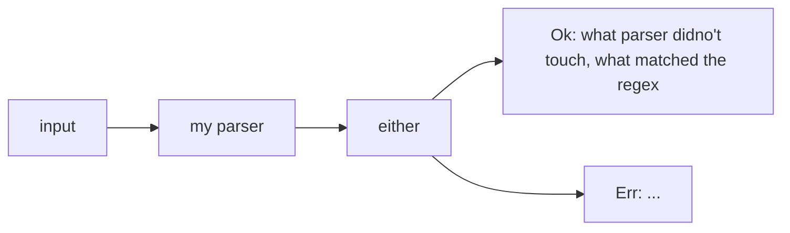

# チュートリアルをやる

チュートリアル的なものが公式にあったのでそれをやる。

- 参考: https://tfpk.github.io/nominomicon/

## chapter 1

パーサーがパースに成功した場合はタプルをラップした値`Ok(<(T_1,T_2)>)`を返し、
失敗した場合では`Err`を返す

ここで成功は欲しい物が見つかった場合で、失敗は、見つからなかった場合である。



`Ok(<(T_1,T_2)>)`中の型T\_1,T\_2はそれぞれパーサーが処理しなかった文字列、パーサーが処理した文字列である。

パーサーが返すこの型は`nom::IResult<I,O)>`として以下で定義されている。

```Rust
pub type IResult<I, O, E = error::Error<I>> = Result<(I, O), Err<E>>;
```

具体例: I: `&str`, O: u64: 文字列から符号なし64bit整数への変換

一番簡単なパーサー: 何にもマッチせずOとして空文字列を返す

```Rust
pub fn do_nothing_parser(input: &str) -> IResult<&str, &str> {
    Ok((input, ""))
}
```

## chapter 2

nomではバイト列を`tag`と呼んでいる。

nomにはこの`tag`をパースするための関数として`nom::bytes::complete::tag()`が存在するので、これを用いる(以下では`tag()`とする)。

まず、`tag()`のシグニチャを見てみよう。

```Rust
pub fn tag<T, Input, Error: ParseError<Input>>(
    tag: T
) -> impl Fn(Input) -> IResult<Input, Input, Error> where
    Input: InputTake + Compare<T>,
    T: InputLength + Clone, 
```

これより型Tのtagを受け取って`impl Fn(Input) -> IResult<Input, Input, Error>`
を返す関数であることがまずわかる。返り値のimplから始まる型はトレイトオブジェクトで、トレイト`Fn(Input) -> IResult<Input, Input, Error>`が実装されている型である。
これによってクロージャーを返す関数として定義されている。

簡単な例として文字列"abc"にマッチするパーサーを書いてみよう。

```Rust
fn parse_input(input: &str) -> IResult<&str, &str> {
    tag("abc")(input)
}
```

`tag("abc")`とすることで`impl Fn(&str) -> IResult<&str, &str>`な値が返ってくるのでそれに対して`&str`型のinputを与えることで"abc"をパースするパーサーが構成される。
`nom::bytes::complete::tag()`は大文字小文字を区別するが、もし大文字小文字を区別しないパーサーが書きたければ`nom::bytes::complete::tag_no_case()`代わりに用いる。

`tag()`は便利ではあるが、限定的である。
nomには、自分で定義した順で文字を受け取るだけではなくいずれの文字のグループのどれでも受け入れられるパーサーが既に実装されている。


- `alpha0`: 0文字以上の大文字小文字のアルファベット(正規表現ならば[a-zA-Z])
- `alpha1`:`alpha0`と同じであるが、少なくとも一文字を返す

- `alphanumeric0`: 0文字以上の大文字小文字か数字(正規表現なら[a-zA-Z0-9]) 
- `alphanumeric1`:a `alphanumeric0`と同じであるが少なくとも一文字を返す 

- `digit0`: 数字(正規表現なら[0-9])
- `digit1`: `digit0`と同じであるが少なくとも一文字を返す 

- `multispace0`: 0個以上のスペース,タブ、CR,LF 
- `multispace0`:  `multispace1`と同じであるが、必ず一文字を返す

- `space0`: 0個以上のスペース
- `space1`: `space0`と同じであるが、必ず一文字を返す

- `line_ending`: 行の終わり \\n,\\r\\n
- `newline`: 改行コード \\n
- `tab`: タブ文字 \\t

これらのパーサーは`tag()`のときのように`IResult<I, O>`を返す関数の中で呼ぶようにすることが重要である。というのもそうでないとコードが冗長でエラー処理がしにくくなるためである。

`alpha0`を用いていアルファベットにマッチした場合は以下のようにパーサーを書く。

```Rust
fn parser_alphabet(input: &str) -> IResult<&str, &str> {
    alpha0(input)
}
```
