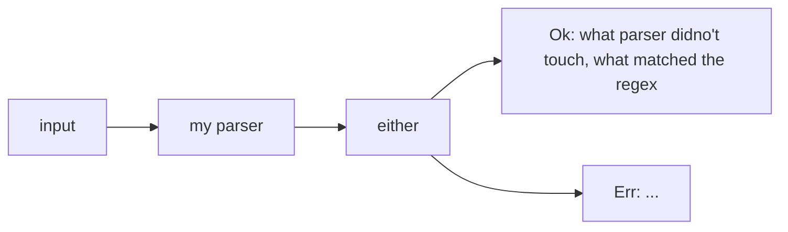

# チュートリアルをやる

チュートリアル的なものが公式にあったのでそれをやる。

- 参考: https://tfpk.github.io/nominomicon/

## chapter 1



パーサーがパースに成功した場合はタプルをラップした値`Ok(<(T_1,T_2)>)`を返し、
失敗した場合では`Err`を返す

タプルの第一フィールド: パーサーが処理しなかった文字列、
タプルの第二フィールド: パーサーが処理した文字列

成功: 欲しい物が見つかった場合
成功: 見つからなかった場合

パーサーが返すこの型は`nom::IResult<I,O)>`として以下で定義されている。

```Rust
pub type IResult<I, O, E = error::Error<I>> = Result<(I, O), Err<E>>;
```

具体例: I: `&str`, O: u64: 文字列から符号なし64bit整数への変換

一番簡単なパーサー: 何にもマッチせずOとして空文字列を返す

```Rust
pub fn do_nothing_parser(input: &str) -> IResult<&str, &str> {
    Ok((input, ""))
}
```

## chapter 2

`nom::bytes::complete::tag`を使う
